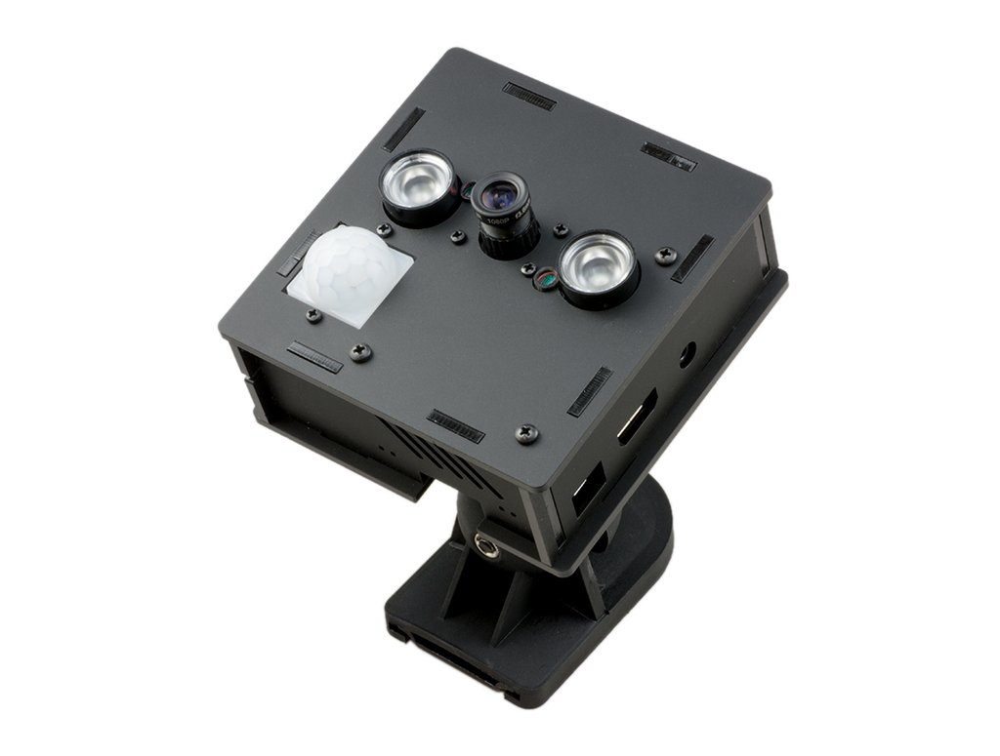

# Py-Motion-Detector
## A Motion detection and logging Python app using a stationary camera

A simple Python3.5/OpenCV app for detecting motion and logging the frames in a directory.
Useful for detecting if your neighbour's pets are using your garden as a public toilet or to give names to the pets you didn't know you had in the house!

The motion detection app expects a motion detection model. The one that is currently provided is based on the excellent tutorial by Adrian Rosebrock
(https://www.pyimagesearch.com/2015/06/01/home-surveillance-and-motion-detection-with-the-raspberry-pi-python-and-opencv/).

Once motion has been detected the motion detection model will return a list of bounding boxes indicating the location of the objects that have been detected, or an empty list if no motion has been detected.

The users can define callback classes to respond to motion detected events. The default callback used by the command line tool is to store the frames where motion has been detected in a user-defined directory along with the bounding boxes stored as jsons.

Use this software responsibly! Don't be a creep.

# Command Line Interface
#### py_motion_detector
This is the main motion detection app. To see all the available options type:
`py_motion_detector --help`

Example: `py_motion_detector -p /home/pi/motion_detected_frames/ -r 800 -m 500 -t 4 -l /tmp/log -i INFO`

#### py_motion_detector_data_player
This is a utility command line tool that replays the stored frames and their bounding boxes. 

Usage: `py_motion_detector_data_player --help`

Example: `py_motion_detector_data_player -p /home/pi/motion_detected_frames/ -w 500 -l`

# Requirements
* Python3.5+
* OpenCV>=3.4.4.19
* Numpy>=1.17.0

# Installation
Type: 

`python setup.py install --user` 

or 

`sudo python setup.py install`

To run all the tests:

`python -m unittest discover tests`

# Running the py-motion-detector on a raspberry pi

## Linux Prerequisites
`pip3 install opencv-python`

`sudo apt-get install libatlas-base-dev`

`sudo apt-get install libjasper-dev`

`sudo apt-get install libqtgui4`

`sudo apt-get install python3-pyqt5`

`sudo apt install libqt4-test`

## To access the camera with OpenCV on a Raspberry pi
Run the following before running the python script:
`sudo modprobe bcm2835-v4l2`
