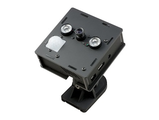

# Py-Motion-Detector

## Introduction
A motion detection and logging application in Python using a stationary camera.



`py-motion-detection` is a Python/OpenCV app that can be used for detecting motion and logging the frames in a directory.

The motion detection app expects a motion detection model. 
The one developed in this project is inspired by the excellent tutorial by [Adrian Rosebrock](https://www.pyimagesearch.com/2015/06/01/home-surveillance-and-motion-detection-with-the-raspberry-pi-python-and-opencv/).

Once motion has been detected the motion detection model will return a list of bounding boxes indicating the location of the objects that have been detected, or an empty list if no motion has been detected.

The users can define callback classes to respond to motion detected events. The default callback used by the command line tool is to store the frames where motion has been detected in a user-defined directory along with the bounding boxes stored as jsons.

## Requirements
* [Poetry](https://python-poetry.org/) 1.8.2 or above
* Python >= 3.12 or above

## Installation
To install `py-motion-detection` run: 

```shell
poetry install
``` 

## Running the Tests
To run all the tests:

```shell
poetry run pytest tests
```

## Generating the Documentation
To read the project's documentation run:

```shell
poetry run mkdocs serve
```

and click on this [link](http://127.0.0.1:8000/).

## Usage

### Command Line Interface

#### Running the motion detection and data logging app

The `py-motion-detection` CLI will start the motion detection app.
To see all the available options of the `py-motion-detection` app run:

```shell
py_motion_detector --help
```

Example usage: 
```shell
py_motion_detector -p $HOME/Downloads/motion_detected_frames/ -r 800 -m 500 -t 4 -l /tmp/log -i INFO
```

#### Logged data player

The `py_motion_detector_data_player` CLI can be used to replay the stored frames and their bounding boxes. 

To see all the available options run: 

```shell
py_motion_detector_data_player --help
```

Example usage: 
```shell
py_motion_detector_data_player -p $HOME/Downloads/motion_detected_frames/ -w 500 -l
```


## Running on a Raspberry pi

### Linux Prerequisites

```shell 
sudo apt-get install libatlas-base-dev
```

```shell
sudo apt-get install libjasper-dev
```

```shell
sudo apt-get install libqtgui4
```

```shell
sudo apt-get install python3-pyqt5
```

```shell
sudo apt install libqt4-test
```

### To access the camera with OpenCV

Run the following before running the python script:
```shell 
sudo modprobe bcm2835-v4l2
```

## Licence 
The content of this site is distributed under [MIT NON-AI License](License.md).
