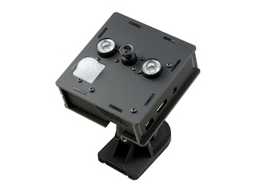

# Py-Motion-Detector

## Description

A motion detection and logging app in Python using a stationary camera.

`py-motion-detection` is a Python/OpenCV app that can be used for detecting motion and logging the frames in a directory.

The motion detection app expects a motion detection model. 
The one developed in this project is inspired by the excellent tutorial by [Adrian Rosebrock](https://www.pyimagesearch.com/2015/06/01/home-surveillance-and-motion-detection-with-the-raspberry-pi-python-and-opencv/).

Once motion has been detected the motion detection model will return a list of bounding boxes indicating the location of the objects that have been detected, or an empty list if no motion has been detected.

The users can define callback classes to respond to motion detected events. The default callback used by the command line tool is to store the frames where motion has been detected in a user-defined directory along with the bounding boxes stored as jsons.

## Requirements
* [Poetry](https://python-poetry.org/)
* Python >= 3.12
